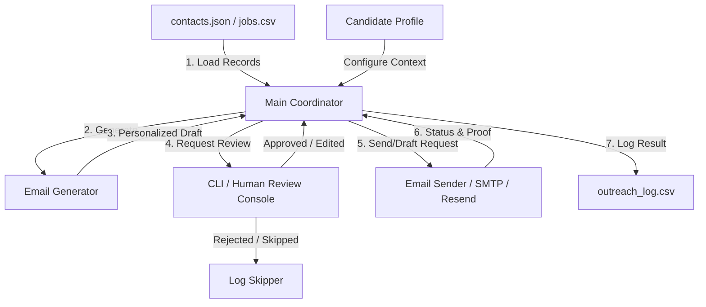
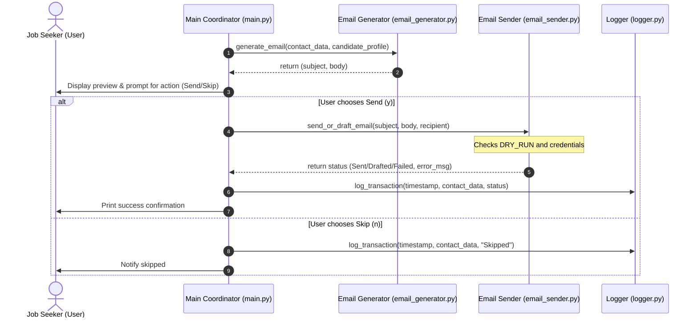

# System Architecture: The Closer (Cold Email Writer + Send Bot)

This document outlines the architecture for **The Closer**, a personalized cold email generation and outreach automation bot. The design focuses on simplicity, safety (human-in-the-loop validation), and modularity, making it easy to explain, demo, and extend.

---

## 1. System Overview

**The Closer** is designed to process job descriptions or recruiter/company information, generate a highly personalized outreach email based on a candidate's background, and present it to the user for manual review. Once approved, the bot either drafts or sends the email using a configured email client or SMTP server, logging the outcome for verification.



---

## 2. Core Components

The application is structured into modular, decoupled components to ensure separation of concerns and ease of maintenance:

### A. Main Coordinator (`main.py`)
- Acts as the orchestrator of the entire lifecycle.
- Initializes configurations from the environment variables (`.env`).
- Reads input data from source files.
- Loops through targets, driving the process from generation, through preview/approval, to dispatching and logging.

### B. Input Data Loader (`contacts.json` or `jobs.csv`)
- Handles parsing and validation of target records.
- Standardizes inputs into a consistent internal data structure (e.g., Python dictionaries or Pydantic models).
- **Core fields required:**
  - `recipient_email`
  - `company`
  - `role`
  - `candidate_name`
  - `candidate_background`

### C. Email Generator (`email_generator.py`)
- Responsible for template composition and formatting.
- Combines candidate context, personalization notes, and job roles into a structured email.
- **Anatomy of generated email:**
  - **Subject Line:** Actionable, short, and personalized.
  - **Personalization Hook:** Customized opening sentence.
  - **Intro & Fit:** Connects candidate experience to the company's open role.
  - **Single Call to Action (CTA):** Clear and low-friction request.
  - **Signature:** Clean sign-off with links (portfolio, GitHub, etc.).
- **LLM-Powered Generation:** Utilizes the Groq LLM API to draft highly contextual and personalized subjects/emails, with a robust deterministic template fallback.

### D. User Console / Human Review Interface (`main.py` CLI)
- A critical safety checkpoint. Prints the generated subject and body clearly.
- Blocks execution to prompt the user for input.
- **Actions supported:**
  - `yes` (or `y`): Proceed with sending/drafting.
  - `no` (or `n`): Skip the recipient.
  - `edit` (or `e`): Allow inline modifications before sending (Stretch goal).

### E. Email Sender (`email_sender.py`)
- Communicates with external email delivery services.
- Supports multiple backends:
  - **SMTP Backend:** Connects to standard mail servers (e.g., Gmail SMTP via App Passwords).
  - **API Backend (Optional):** Integrates with Resend or SendGrid APIs.
  - **Draft Mode (Safety Mode):** Utilizes APIs to create draft messages in Gmail/Outlook instead of sending immediately.
- **Dry-Run Guard:** If `DRY_RUN=true` (default), the sender prints the email to the console and simulates a successful delivery without hitting any network endpoint.

### F. Logger (`logger.py`)
- Records outreach attempts to `outreach_log.csv`.
- Logs structural details: Timestamp, Recipient Email, Company, Role, Subject, Status (Generated, Drafted, Sent, Skipped, Failed), and Error Messages (if any).

---

## 3. Data Flow and Sequence

The diagram below describes the sequence of execution for processing a single contact record.



---

## 4. Architectural Safety Controls & Guardrails

To prevent misuse, accidental spamming, and rate-limiting blocks, the system enforces the following safety controls:

| Guardrail | Implementation | Purpose |
| :--- | :--- | :--- |
| **Dry-Run Mode** | Controlled via `DRY_RUN=true` in `.env` | Prevents accidental API charges or sending real emails during testing. |
| **Human-in-the-Loop** | Blocking prompt in terminal | Prevents fully automated mass emailing (spamming) and ensures high-quality personalized review. |
| **Low-Volume Focus** | Hardcoded batch limits or sequential processing | Discourages bulk lists and preserves sender domain reputation. |
| **Opt-Out Checking** | Deduplication check against blocklist (Optional) | Respects recipient privacy and opt-outs. |
| **Input Validation** | Rejects templates without personalization fields | Avoids sending generic placeholders to recruiters. |

---

## 5. File Structure

The project follows a clean, modular pythonic design:

```text
the-closer/
├── .env.example          # Sample configuration template
├── .gitignore            # Excludes secrets, logs, and venv
├── README.md             # Setup and running instructions
├── architectural.md      # System architecture and design (this file)
├── contacts.json         # Input JSON file containing target contacts
├── email_generator.py    # Template logic and prompt injection
├── email_sender.py       # SMTP, Gmail API, and Resend drivers
├── logger.py             # CSV logging routines
├── main.py               # Application runner and entry point
├── outreach_log.csv      # Local log file storing transaction histories
└── requirements.txt      # Python dependencies (python-dotenv, etc.)
```

---

## 6. Environment & Configuration

Configurations are injected through environment variables at startup. 

```ini
# Core Configuration
DRY_RUN=true                      # Keep true for safety during testing
SENDER_NAME="Your Name"

# SMTP Settings (Alternative A)
SMTP_HOST=smtp.gmail.com
SMTP_PORT=587
SMTP_USER=your_email@gmail.com
SMTP_PASSWORD=your_app_password  # Use Gmail App Password, not main password

# Groq LLM Settings
GROQ_API_KEY=gsk_your_groq_api_key
GROQ_MODEL=llama-3.3-70b-specdec

# API Settings (Alternative B - Optional)
RESEND_API_KEY=re_your_api_key

```
